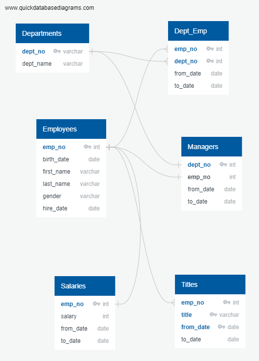

# Pewlett-Hackard-Analysis
_Solve HR problems by converting CSVs into database tables and using sql to form additional dimensions of data to provide recommendations._

- The repository here shows how I can help a mock company's HR problem with some data analytic techniques.  I started with the manager's criteria and inquiry for data, and for available data sources I must make use of a few given csv files.  I was tasked with providing technical analysis in various dimensions.  These analysis and data dimensions were based upon a need for the company manager handle a "Silver Tsunami".  A wave of employees are expected retiring, hence our goal is to help the business manager to form data driven decisions surrounding this concern.  

_Deliverables and Details_
- For the first deliverable, I created an ERD (Entity Relationship Diagram) .

  This diagram helped me understand how properly to set up tables within the database, as well as served to aid me visually in process of data analysis.  Once the ERD and various tables were created, I was able to use sql query with inner join on 2 tables to form the data that I needed.  As a criteria by the manager, the query only return employees that are retiring (born 1952-1955) and grouped the result by job title.  The data is then inserted into to `deliv1` [deliverable1.1.csv](data\deliverable1.1.csv).  Since the result had duplicate employees due to multiple positions over a tenure, I further used sql partition method to collect only a single instance of the result ordered by employee's latest position.  This second result was put into a second table called `deliv1_2` [deliverable1.2.csv](data\deliverable1.2.csv).  Lastly, the second deliverable identify those employee that have a specific birth dates (1965) for mentorship.  By using 2 inner joins of 3 tables, I was able to collect employee number (a common key to join on), _first and last name_, _title_ and _from and to date_ and their _title_.  

_Final Conclusion and Thoughts_
- The result of the analysis showed that there were [133,776 employee](data\deliverable1.1.csv), and with duplicates removed [90398 employees](data\deliverable1.2.csv) are in the retirement age group.  We also found [3125 employees](data\deliverable2.csv) qualify for mentorship program as mentors by finding those born in 1965.  The limitation of the existing table and analysis does not clearly shown the most recent salary and title of mentors as duplicates are shown.  One can further analyze the data to tease out the most current salary and title without duplicates.  We may also want to expand the birth year for mentorship in case more participants are needed.  Another dimension of data which may be useful is payroll impact by ways of retiree's salary sum.  The data and recommendation limitation should be considered as data here do not cover additional dimensions of business variables and procedures, a business stakeholder should supplement the analysis with additional real world practices.  
